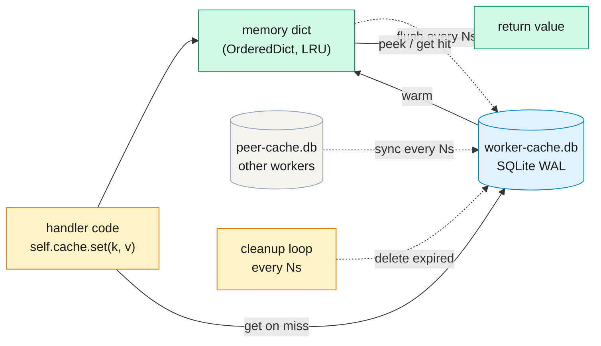
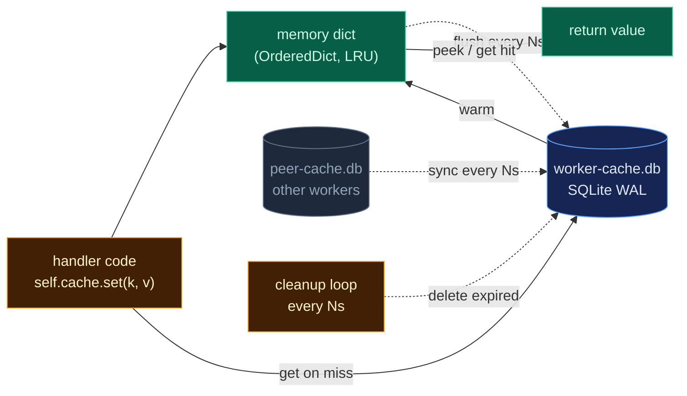

# Cache

A framework-provided key/value cache accessible as `self.cache` on every
handler. Memory-backed for hot reads, flushed to a per-worker SQLite file
via a periodic write-behind loop, and optionally shared across workers via
a periodic peer-sync loop.

The cache is **opt-in** (`cache.enabled=false` by default). When disabled,
`handler.cache` is a no-op stub so handler code can call `self.cache.set(...)`
unconditionally — no `if self.cache is not None` guards.

---

## What it solves

Before this feature, handlers that wanted to memoize subprocess results
had to hand-roll their own dict + TTL + eviction policy (see the pre-cache
integration demo). Each ad-hoc cache reinvented:

- Eviction when the dict grew unbounded
- Hit/miss counters and metrics
- TTL bookkeeping
- Durability across worker restarts
- Cross-worker visibility

Drakkar's cache gives you all of these for free, plus:

- `arrange()` can short-circuit tasks with
  [`PrecomputedResult`](handler.md#precomputed-task-results-skip-the-subprocess)
  built from a cache hit — skipping the subprocess entirely.
- Workers in the same cluster can share cached values via peer sync
  (eventually consistent, LWW).
- Operators inspect cache contents in the debug UI and scrape size/hit
  metrics via Prometheus.

---

## How it flows

<div class="diagram-light" markdown>

</div>

<div class="diagram-dark" markdown>

</div>

Three periodic loops run alongside the main processing pipeline, registered
as **system** periodic tasks (they appear with a `[system]` badge on the
debug UI's periodic tasks page alongside user-defined `@periodic` methods):

| Loop | Default interval | What it does |
|------|------------------|--------------|
| `cache.flush` | `flush_interval_seconds` (3s) | Drains the pending `_dirty` map to SQLite via `UPSERT` / `DELETE` in one transaction |
| `cache.sync` | `peer_sync.interval_seconds` (30s) | Pulls recent rows from peer workers' `-cache.db` files, LWW-merges into local DB |
| `cache.cleanup` | `cleanup_interval_seconds` (60s) | Removes rows where `expires_at_ms < now_ms`; refreshes DB-size Prometheus gauges |

A reader aiosqlite connection is opened alongside the writer so `get()`
DB-fallback queries never queue behind a flush/sync/cleanup commit. WAL
mode lets the reader see consistent snapshots during concurrent writes.

---

## Minimal example: memoize a subprocess result

```python
import drakkar as dk
from drakkar import CacheScope

class MyHandler(dk.BaseDrakkarHandler[MyInput, MyOutput]):
    async def arrange(self, messages, pending):
        tasks = []
        for msg in messages:
            req = msg.payload
            cache_key = f'search|{req.pattern}|{req.file_path}'

            # Fast path: synchronous memory peek (no DB, no I/O)
            cached = self.cache.peek(cache_key)
            if cached is None:
                # Slower path: memory miss, check SQLite (local + peer-synced)
                cached = await self.cache.get(cache_key)

            if cached is not None:
                # Skip the subprocess entirely — hand the result back directly
                tasks.append(dk.ExecutorTask(
                    task_id=dk.make_task_id('search'),
                    source_offsets=[msg.offset],
                    metadata={'request_id': req.request_id},
                    labels={'source': 'cache'},
                    precomputed=dk.PrecomputedResult(stdout=cached),
                ))
                continue

            # Cache miss: run the subprocess
            tasks.append(dk.ExecutorTask(
                task_id=dk.make_task_id('search'),
                args=[req.pattern, req.file_path],
                source_offsets=[msg.offset],
                metadata={'request_id': req.request_id},
                labels={'source': 'subprocess'},
            ))
        return tasks

    async def on_task_complete(self, result):
        # Persist the result back into the cache for next time.
        # Only genuine subprocess runs need this — precomputed hits are
        # already in the cache (that's where they came from).
        if result.pid is not None:
            meta = result.task.metadata
            cache_key = f'search|{meta["pattern"]}|{meta["file_path"]}'
            self.cache.set(
                cache_key,
                result.stdout,
                ttl=3600,           # 1 hour TTL
                scope=CacheScope.LOCAL,
            )
        # ... return CollectResult with sink payloads as usual
```

And the matching config:

```yaml
cache:
  enabled: true
  # db_dir: ""           # empty → falls back to debug.db_dir
  flush_interval_seconds: 3.0
  cleanup_interval_seconds: 60.0
  max_memory_entries: 10000     # LRU cap; omit for unbounded
  peer_sync:
    enabled: true
    interval_seconds: 30.0
    batch_size: 500
    timeout_seconds: 5.0
    # Upper bound on a single sync cycle. When None (default), derived as
    # interval_seconds * 0.9 so the next scheduled tick never overlaps the
    # current one. Set an explicit value when peers live on slow storage
    # (NFS, cross-region) and you want a tighter cap than the derived
    # default — but stay strictly below interval_seconds (config load
    # fails otherwise, so a misconfiguration surfaces at startup).
    cycle_deadline_seconds: null
```

`cycle_deadline_seconds` caps each `cache.sync` cycle. When the deadline
fires, `_sync_once` tears down the in-flight peer reads, ticks the
unlabelled `cache_peer_sync_timeouts_total` counter, and raises
`TimeoutError` so the periodic-task wrapper classifies the run as
`status=error` — dashboards keyed on
`periodic_task_runs{status='error'}` pick up deadline breaches through
the same alerting path as other failures. The periodic loop keeps
running (the wrapper's default on-error behavior is to log + schedule
the next tick), so a single deadline fire does not disable peer sync.

---

## API reference

```python
class Cache:
    def set(
        self,
        key: str,
        value: Any,
        *,
        ttl: float | None = None,
        scope: CacheScope = CacheScope.LOCAL,
    ) -> None: ...

    def peek(self, key: str) -> Any | None: ...
    def delete(self, key: str) -> bool: ...
    def __contains__(self, key: str) -> bool: ...

    async def get(
        self,
        key: str,
        *,
        as_type: type[T] | None = None,
    ) -> Any | None: ...
```

### `set(key, value, *, ttl=None, scope=CacheScope.LOCAL)`

Stores `value` under `key` in the in-memory dict and schedules a flush to
SQLite on the next flush cycle. Synchronous — no I/O happens at call time.

`value` can be any JSON-serializable primitive (`str`, `int`, `float`,
`bool`, `None`, `list`, `dict`) or a Pydantic `BaseModel`. Pydantic models
are serialized via `model_dump_json()`. Anything else raises `TypeError`
at `set()` time (deliberately — clearer error now than a silent failure
on a peer that can't parse the value later).

`ttl` is in **seconds** (fractional OK). `None` means "never expires"
(the entry will remain until explicitly deleted or the worker's cache DB
is wiped).

`scope` controls peer-sync visibility. See [CacheScope](#cachescope) below.

### `peek(key)`

Memory-only lookup. Returns the decoded value if the key is in memory
and unexpired; `None` otherwise. Never hits the DB — intended for
`arrange()`'s hot path where you want zero I/O.

`peek` bumps the key to MRU position in the LRU order. Expired entries
are opportunistically evicted.

!!! note "peek() is NOT counted in hit/miss metrics"
    `drakkar_cache_hits_total` and `drakkar_cache_misses_total` are
    incremented by `get()` only. `peek()` is a memory probe — counting
    it would double-count if a caller does peek-then-get.

### `async get(key, *, as_type=None)`

Async lookup with DB fallback. Lookup order:

1. **Memory hit** — key in `_memory` and unexpired → return without DB
   access. LRU-bump.
2. **DB fallback** — memory miss → SELECT on the reader connection,
   filtered by `expires_at_ms IS NULL OR expires_at_ms > now`.
3. **Warm memory** — DB hit → rebuild the entry in `_memory` at MRU
   position (may trigger LRU eviction if `max_memory_entries` is set).

`as_type=SomeModel` revives the JSON value via `SomeModel.model_validate()`
for typed return. Without it, `get` returns the raw `json.loads` result
(primitives / lists / dicts).

Increments `drakkar_cache_hits_total{source="memory"}` on memory hit,
`drakkar_cache_hits_total{source="db"}` on DB hit,
`drakkar_cache_misses_total` on miss.

### `delete(key)`

Removes the key from memory and schedules a DB row deletion on next
flush. Returns `True` if the key was present in memory, `False` otherwise.

!!! warning "Delete is local-only — use TTL for cross-worker invalidation"
    `delete(key)` removes the row from **this worker's** cache DB. Peers
    that already synced the value keep their copy until it expires via
    TTL or is overwritten. Worse, if a peer's copy has a newer
    `updated_at_ms` than any local state, the next sync cycle may
    **re-pull the deleted value back** (LWW will accept it).

    For cross-worker invalidation, **use TTL** — set a short TTL when
    writing, or overwrite with a dummy/tombstone value. True delete
    propagation would require tombstone rows and GC, which is out of
    scope for v1.

### `__contains__(key)`

`key in self.cache` — returns `True` if the key is in memory and
unexpired. Does **not** bump LRU position (membership is a probe, not an
access). Does not consult the DB.

### CacheScope

```python
class CacheScope(StrEnum):
    LOCAL = 'local'       # this worker only; peers never pull
    CLUSTER = 'cluster'   # same-cluster peers pull via sync
    GLOBAL = 'global'     # all peers (any cluster) pull via sync
```

Scope filters peer sync's `SELECT` when another worker pulls from your
cache DB:

- Same cluster peer pulls `scope IN ('cluster', 'global')`
- Different cluster peer pulls `scope = 'global'` only
- `scope = 'local'` never leaves this worker

---

## Choosing a scope

| Scope | Use when | Example |
|-------|----------|---------|
| `LOCAL` | Per-worker results that peers will compute independently (or that are worker-specific) | Hot-path subprocess memoization; per-worker rate limit counters |
| `CLUSTER` | Expensive results worth sharing across workers in the same deployment | Regex match results over a shared corpus; enrichment lookups |
| `GLOBAL` | Results universal across clusters (rare — usually signals "this is really a DB sink") | Cross-deployment config distribution (unusual) |

When unsure, start with `LOCAL`. The default is `LOCAL` specifically
because it's the safe choice — LOCAL entries stay put, peers never see
them, and if you later decide to share, you flip the scope on new
writes without touching consumers.

---

## Cache vs. real DB sink vs. compute-every-time

| Question | Choose... |
|----------|----------|
| "Do I need this value to survive a cluster-wide crash?" | **DB sink** (Postgres, Redis with persistence). Cache entries live in per-worker SQLite files with TTL retention — fine for optimization, not for durability-critical state. |
| "Is recomputation cheap (< subprocess launch cost)?" | **Compute every time.** A 50us Python function is not worth caching. |
| "Is recomputation expensive, and would it be OK to recompute on a cold cache?" | **Cache.** Cold start is bounded by whatever time it takes for reasonable cache population via normal traffic. |
| "Do I need strict consistency across workers?" | **Not cache.** Cache is eventually consistent (peer sync lags + LWW + no tombstones). Use Redis / Postgres / a distributed consensus system. |
| "Is the value small, JSON-serializable, and idempotent?" | **Cache fits well.** |
| "Does the value contain secrets?" | **Not cache.** Cache DBs are downloadable from the debug UI (same as recorder DBs). No redaction layer applies to cache values. |

---

## Edge cases and sharp edges

### Cold cache on worker restart

When a worker restarts, its in-memory dict is empty. The DB file
(`<worker>-cache.db`) still has all the entries, so `get()` will
lazily warm memory on first access per key. There is **no eager
preload** on startup — adding it would stall startup and race with
normal traffic. The plan considered and rejected it (YAGNI: normal
traffic warms the cache within one flush cycle).

The peer-sync cursor resets to 0 on restart, so the worker also
re-pulls everything from peers once. Bounded by TTL cleanup and LWW
rejection — no runaway work.

### TTL vs. delete

**TTL is the recommended invalidation mechanism.** Set a TTL when
writing; never call `delete` unless you mean "remove this from my own
worker's memory, and peers may still have it."

Reasoning: peers who synced a value before a `delete` keep their copy.
If any peer has `updated_at_ms` newer than your "deleted" state, the
next sync may re-pull the value back into your DB via LWW. TTL
naturally expires everywhere (every worker runs its own cleanup loop).

### Peer unreachable

The sync loop iterates peers one at a time, each wrapped in
`try/except`. A failed peer (connection refused, corrupt DB, missing
file, read timeout) logs a warning, increments
`drakkar_cache_sync_errors_total{peer=...}`, and the loop continues
to the next peer. The worker keeps running. One bad peer cannot break
the whole sync cycle.

The peer's cursor is unaffected by other peers' state — each peer has
its own `_peer_cursors[peer_name]` entry. Recovery is automatic on the
next sync tick.

### Cross-cluster visibility

Peer sync uses the same worker-autodiscovery mechanism as the flight
recorder (see [Worker Autodiscovery](observability.md#worker-autodiscovery)).
Workers are grouped by `cluster_name` (from `DrakkarConfig.cluster_name`
or `cluster_name_env`).

A peer's scope filter depends on cluster membership:

- Peer in same cluster as self → pulls `scope IN ('cluster', 'global')`
- Peer in different cluster → pulls `scope = 'global'` only

Unclustered workers (`cluster_name=''`) are treated as a single
implicit cluster — they pull cluster-scoped entries from other
unclustered workers, and global-scoped entries from anyone.

### LRU eviction

`max_memory_entries=10_000` (**default**) → the in-memory dict is capped at
10,000 entries. Production-safe default — prevents unbounded growth under
write-heavy workloads. Entries beyond the cap are evicted LRU, with pending
dirty-ops preserved (see below).

`max_memory_entries=None` → the in-memory dict grows unbounded. Set this
explicitly only when you have a bounded key universe or your own eviction
strategy. The config layer emits a `cache_max_memory_entries_unbounded`
warning at startup so the intentional choice is visible in logs — unlike the
default, this knob needs operator awareness.

When the cap is set and adding the N+1-th entry would exceed it, the
**least-recently-used** key is popped from the dict. Its pending dirty-op
(if any) is **preserved** — the DB is the source of truth, and losing a
dirty SET before flush would silently drop the write.

Evicted keys fall through to the DB on the next `get()`, which warms
memory again (and may evict a different key in turn). The
`drakkar_cache_evictions_total` counter tracks churn — a sustained
high rate means the cap is undersized for the working set.

### Secrets in cache values

The recorder redacts secrets before writing `worker_config`
([see the warning in Observability](observability.md#worker_config-autodiscovery)).
The cache does **not** apply such redaction: cache values are written
verbatim. Do not put secrets in the cache if the DB file is
downloadable through the debug UI in your deployment.

### Delete is local-only (the main sharp edge)

Repeated here because it's the single behavior most likely to surprise.
See [`delete()` above](#deletekey) for the full story.

**Rule of thumb:** for cross-worker invalidation, **use TTL**, not
`delete`.

---

## Consistency model

- **Eventually consistent** across workers. A `set()` on worker A is
  visible on worker B at most ~(flush_interval + sync_interval) later
  (default: 3s + 30s = 33s).
- **Worst-case staleness**, concretely: local durability is bounded by
  `flush_interval_seconds` (default 3s); cross-worker freshness is
  bounded by `flush_interval_seconds + peer_sync.interval_seconds`
  (default 3s + 30s = 33s). Size intervals based on your tolerance —
  halving both to 1.5s/15s trades more SQLite + peer-disk traffic for
  tighter staleness. The cache never promises stricter consistency than
  those intervals; anything that needs real consistency should use a
  real DB sink, not this cache.
- **LWW (last-write-wins)** by `updated_at_ms`, with lexicographically
  smaller `origin_worker_id` as the tiebreaker for equal timestamps.
  Identical SQL (`LWW_UPSERT_SQL`) is used by local flushes and
  peer-sync merges, so local and cross-worker paths cannot diverge.
- **No tombstones in v1.** `delete` is local-only. Use TTL.
- **Durability window** = `flush_interval_seconds` (default 3s). A
  worker crash between `set()` and the next flush loses the
  unflushed writes. Tune shorter for stricter durability at the cost
  of more SQLite transactions.
- **Wall-clock dependent.** LWW compares `updated_at_ms` across
  workers, which assumes NTP-sync'd hosts. Wall-clock skew of a few
  seconds is fine; multi-minute skew would break LWW fairness.
- **`size_bytes` is UTF-8 byte length.** The in-memory ``bytes_in_memory``
  gauge (and its DB counterpart ``bytes_in_db``) sum the **byte length
  of the JSON-encoded value** (`len(json_text.encode('utf-8'))`) — not
  the Python-object size, not character count. Non-ASCII characters
  cost 2–4 bytes each. When sizing capacity from the gauge, budget
  against UTF-8 byte counts: a 100-char Cyrillic string costs 200
  bytes, not 100.

---

## Debug UI walkthrough

When `cache.enabled=true`, the debug UI gains a **Cache** nav link that
opens `/debug/cache`.

### `/debug/cache` — entries browser

- Header stats: in-memory entries / bytes, DB entries / bytes
- Filter bar: scope dropdown, key-prefix search, "show only expired"
  toggle
- Paginated table of entries (limit default 100, max 1000): key,
  scope, size, age, TTL remaining, origin worker
- Side panel on click: decoded JSON value + full metadata
  (created_at, updated_at, expires_at, origin_worker_id)

### `/debug/periodic` — system periodic tasks

The existing periodic tasks page now shows `cache.flush`, `cache.sync`,
and `cache.cleanup` alongside user-defined `@periodic` methods, each
with a small `[system]` pill indicating framework origin. Status, last
run, duration, success/error counts, and sparkline of recent runs are
rendered identically to user periodic tasks — the `[system]` pill is
the only visual difference.

### Prometheus metrics page

All [cache metrics](observability.md#cache) appear on the `/debug`
metrics viewer alongside the rest of the framework metrics.

### Message Probe tab — cache is read-only

The **Message Probe** tab on `/debug` runs a pasted message through the
full handler pipeline without touching production state. In this mode
**all cache writes are silently suppressed** (`set`, `delete`) — the
probe's `DebugCacheProxy` records every call but never mutates the live
cache. Reads are **opt-in** via the *Use cache (read-only)* checkbox: when
enabled, `get` / `peek` / `__contains__` forward to the real cache and
show accurate hit/miss outcomes in the call log; when disabled, all reads
return a miss even for keys that exist. Every call (including suppressed
writes) is captured with `op`, `key`, `scope`, `outcome`, and the
originating hook stage, so the probe report lets you audit what the
handler asked of the cache without disturbing its state.

---

## Related pages

- [Handler](handler.md) — the handler class surface that exposes `self.cache`
- [PrecomputedResult](handler.md#precomputed-task-results-skip-the-subprocess)
  — how cache hits short-circuit tasks
- [Observability](observability.md) — Prometheus metrics, debug UI details
- [Performance](performance.md) — when caching helps, the `PrecomputedResult`
  fast path
- [Worker Autodiscovery](observability.md#worker-autodiscovery) — the
  shared-db_dir convention that peer sync reuses
- [Integration Tests](integration.md) — the docker-compose demo exercises
  cache fast-path, peer sync, and disk persistence
