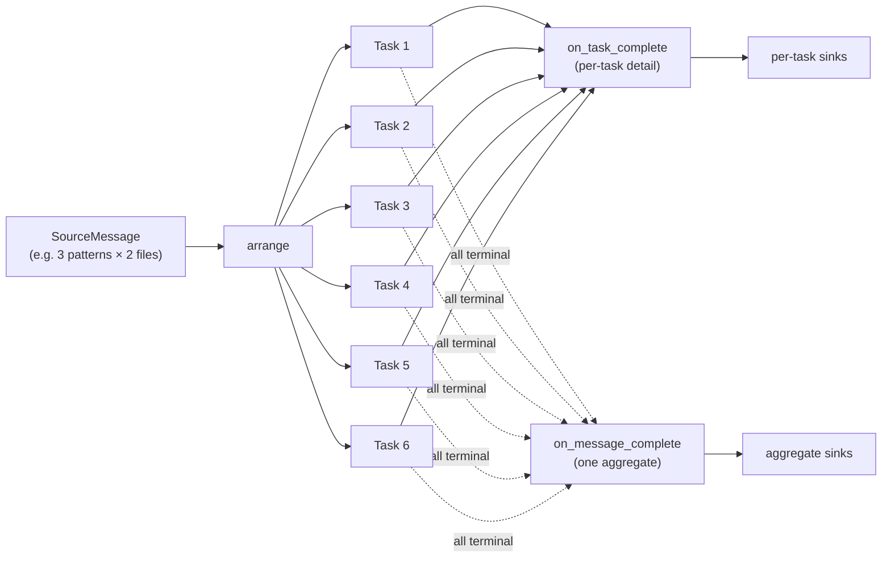

# Fan-out: One Message → Many Tasks → One Aggregate

A common pipeline shape: one incoming message describes work that must be
split into many subprocess invocations, and the useful output is a
**single aggregated record** over all those subprocess outcomes — not
one output per task.

Drakkar supports this natively via the `on_message_complete` hook and
the `MessageGroup` dataclass.

!!! info "When to use this page"
    If your pipeline is strictly 1-in / 1-out (one input → one subprocess
    → one output), you don't need any of this — use `on_task_complete`
    and ignore the rest of the page. This page is for pipelines where
    one input deliberately produces *several* subprocess tasks.

---

## The shape



- `arrange()` expands the input into N tasks (the fan-out)
- `on_task_complete(result)` fires **once per task** — typical per-task fanout
- `on_message_complete(group)` fires **once per source message**, after every
  task derived from it has reached a terminal state

The two hooks are independent. You can use both, either, or neither.

---

## The `MessageGroup` passed to `on_message_complete`

```python
class MessageGroup(BaseModel):
    source_message: SourceMessage           # the original Kafka message
    tasks: list[ExecutorTask]               # full history (see below)
    results: list[ExecutorResult]           # terminal successes
    errors: list[ExecutorError]             # terminal failures (SKIP / retries exhausted)
    started_at: float                       # monotonic, when arrange() scheduled first task
    finished_at: float                      # monotonic, when last task terminal'd

    # Convenience properties
    succeeded: int      # len(results)
    failed: int         # len(errors)
    total: int          # len(tasks) — includes REPLACED tasks (see below)
    replaced: int       # total - succeeded - failed
    all_succeeded: bool # True iff total > 0 and failed == 0
    any_failed: bool    # failed > 0
    is_empty: bool      # total == 0 (arrange() returned nothing)
    duration_seconds: float
```

### What counts as "terminal"?

A task is **terminal** when its outcome is decided:

| Outcome | Contributes to |
|---|---|
| Subprocess exit 0, `on_task_complete` ran | `results` |
| `on_error` returned `SKIP` | `errors` |
| `on_error` returned `RETRY`, retries exhausted | `errors` |
| `on_error` returned `list[ExecutorTask]` (replaced) | **neither** — the replacements take its place |
| Unexpected exception in `on_task_complete` | `errors` (synthesised) |

Replaced-original tasks are kept in `tasks` (full history for debugging)
but not counted in `results` or `errors`. The REPLACEMENTS eventually
land in `results` or `errors` as their own terminal outcomes.

You can always recover the replacement count:

```python
group.replaced == group.total - group.succeeded - group.failed
```

### Tracing the replacement chain

Every task the framework schedules in response to an `on_error` list-return
has its `parent_task_id` auto-populated with the failing task's `task_id`
(unless the handler explicitly set it). In `on_message_complete` you can
walk the chain upward to find the arrange()-produced root:

```python
async def on_message_complete(self, group):
    by_id = {t.task_id: t for t in group.tasks}
    for task in group.tasks:
        chain = [task]
        while chain[-1].parent_task_id:
            chain.append(by_id[chain[-1].parent_task_id])
        # chain[0] is this task; chain[-1] is the original arrange() task
```

---

## A minimal example

```python
from pydantic import BaseModel, Field
import drakkar as dk


class SearchRequest(BaseModel):
    request_id: str
    patterns: list[str] = Field(min_length=1)
    file_paths: list[str] = Field(min_length=1)


class PerTaskResult(BaseModel):
    request_id: str
    pattern: str
    file_path: str
    match_count: int


class RequestSummary(BaseModel):
    request_id: str
    total_tasks: int
    succeeded: int
    failed: int
    total_matches: int


class MyHandler(dk.BaseDrakkarHandler[SearchRequest, PerTaskResult]):
    async def arrange(self, messages, pending):
        # One message → patterns × files tasks. Every produced task
        # shares the message's source_offsets — this is what binds them
        # into a MessageGroup.
        tasks = []
        for msg in messages:
            req = msg.payload
            for pattern in req.patterns:
                for file_path in req.file_paths:
                    tasks.append(
                        dk.ExecutorTask(
                            task_id=dk.make_task_id('search'),
                            args=[pattern, file_path],
                            metadata={
                                'request_id': req.request_id,
                                'pattern': pattern,
                                'file_path': file_path,
                            },
                            source_offsets=[msg.offset],
                        )
                    )
        return tasks

    async def on_task_complete(self, result):
        """Fine-grained per-task output (optional)."""
        meta = result.task.metadata
        matches = sum(1 for line in result.stdout.split('\n') if line)
        per_task = PerTaskResult(
            request_id=meta['request_id'],
            pattern=meta['pattern'],
            file_path=meta['file_path'],
            match_count=matches,
        )
        return dk.CollectResult(
            kafka=[dk.KafkaPayload(data=per_task, key=meta['request_id'].encode())],
        )

    async def on_message_complete(self, group):
        """Called ONCE per SearchRequest, after all its tasks finished."""
        req: SearchRequest = group.source_message.payload
        if req is None or group.is_empty:
            return None

        total_matches = sum(
            sum(1 for line in r.stdout.split('\n') if line)
            for r in group.results
        )

        summary = RequestSummary(
            request_id=req.request_id,
            total_tasks=group.total,
            succeeded=group.succeeded,
            failed=group.failed,
            total_matches=total_matches,
        )

        # One aggregate record per request to a "summaries" topic.
        return dk.CollectResult(
            kafka=[
                dk.KafkaPayload(
                    data=summary,
                    key=req.request_id.encode(),
                    sink='summaries',
                ),
            ],
        )
```

---

## Offset commit semantics

Offsets are committed **per source message**, after `on_message_complete`
returns. This means:

- A fast message whose tasks finish quickly commits its offset immediately,
  even if another (slow) message in the same arrange() window is still
  in flight.
- If `on_message_complete` raises, the exception is logged and offsets
  commit anyway — the raise doesn't stall the partition.
- On crash / revoke before `on_message_complete` completes, the offset
  is NOT committed. The message replays on restart (at-least-once).
  Any partial side effects already delivered via `on_task_complete` are
  duplicated on replay; design downstream sinks to be idempotent (use
  `request_id` as a primary/dedup key).

!!! tip "At-least-once, not exactly-once"
    Replays can cause duplicates in the per-task sinks. The message-level
    aggregate in `on_message_complete` is at-least-once too: a crash
    between "aggregate delivered to Kafka" and "offset committed to Kafka"
    produces a duplicate aggregate on replay. If this matters, dedupe
    downstream by `(request_id, partition, offset)`.

---

## Choosing which hook(s) to implement

| Your shape | Use |
|---|---|
| 1 message → 1 task → 1 output | just `on_task_complete` |
| 1 message → N tasks → N outputs | just `on_task_complete` |
| 1 message → N tasks → **1 aggregate output** | `on_message_complete` only (return `None` from `on_task_complete`) |
| 1 message → N tasks → N detail + 1 aggregate | BOTH `on_task_complete` and `on_message_complete` |
| Multi-message batch metrics | `on_window_complete` (coarser than message-level) |

All three hooks coexist — they fire on the same underlying data but at
different granularities. Which to use is a choice about what you want
downstream consumers to see, not a framework constraint.

### `on_message_complete` vs `on_window_complete`

| | `on_message_complete` | `on_window_complete` |
|---|---|---|
| Fires for | one source message | one arrange() batch |
| Receives | `MessageGroup` | `list[ExecutorResult]`, `list[SourceMessage]` |
| Granularity | per-message | per-window (may span many messages) |
| Offset commit order | **before** commit | **after** some offsets may already be committed |
| Typical use | request-level aggregation | dashboard metrics, window-level logs |

---

## Error handling across the group

The group doesn't need every task to succeed to fire. The hook ALWAYS
fires when all tasks reach a terminal state, whether that's success or
failure. Decide what to emit based on the group's shape:

```python
async def on_message_complete(self, group):
    if group.is_empty:
        # arrange() returned nothing for this message — you may still
        # want to emit an audit record so the request isn't invisible.
        return self._emit_skipped(group.source_message)

    if group.all_succeeded:
        return self._emit_success_aggregate(group)

    if group.any_failed and group.succeeded == 0:
        # Every task failed — emit a dead-letter-style summary.
        return self._emit_total_failure(group)

    # Partial failure: some succeeded, some didn't.
    return self._emit_partial_aggregate(group)
```

### Replacement chains

`on_error` returning a replacement list is a common pattern for
"subdivide a failed task into smaller work." The replacements become
part of the same `MessageGroup` automatically — the group doesn't
complete until every replacement (and any *further* replacements from
their failures) settles.

```python
async def on_error(self, task, error):
    if error.exception and 'memory' in (error.exception or '').lower():
        # Split the file in half and try each part as a smaller task.
        return [
            dk.ExecutorTask(
                task_id=dk.make_task_id('half1'),
                args=[...],
                source_offsets=task.source_offsets,  # REQUIRED: inherit
            ),
            dk.ExecutorTask(
                task_id=dk.make_task_id('half2'),
                args=[...],
                source_offsets=task.source_offsets,
            ),
        ]
    return dk.ErrorAction.SKIP
```

!!! warning "Replacements must inherit `source_offsets`"
    A replacement task with empty or different `source_offsets` will not
    be tracked by the original message's `MessageGroup`. Copy
    `task.source_offsets` onto every replacement unless you deliberately
    want to detach it.

    The framework auto-populates `parent_task_id` so you can trace the
    chain later; `source_offsets` is the handler's responsibility.

---

## Multi-message tasks (fan-IN)

If a task has `source_offsets = [a, b, c]` (one task represents work for
three source messages), it participates in THREE `MessageGroup`s. Its
terminal outcome is reported to all of them. Each group only completes
when every task it has a stake in has reached a terminal state.

This is uncommon but legitimate — e.g. deduplication or cross-message
work. The tracking is transparent; nothing special is needed in the
handler.

---

## What's NOT in scope (yet)

Grouping that spans **multiple source messages** (e.g. "wait for 5
related messages with the same business key, then aggregate across them")
is a different problem — it's stateful aggregation, and it interacts
with Kafka partitioning in ways that can't be hidden behind a handler
hook without serious trade-offs.

Drakkar's current stance: **do that downstream**. Emit your
`on_message_complete` aggregates to a Kafka topic, and run a second
Drakkar worker (or Kafka Streams / Flink / your own consumer) that
groups those aggregates by business key. That worker owns the group
state and the termination condition.

A future `get_source_group_id(msg)` + `on_source_group_complete(group)`
hook for same-partition grouping may land once the termination semantics
are worked out.

---

## Events emitted by the recorder

Each hook completion produces a distinct event in the flight recorder,
so the debug UI, Prometheus queries, and downstream tooling can tell
the three stages apart:

| Event | Fires after | Grain |
|---|---|---|
| `task_complete` | `on_task_complete()` returns | per task |
| `message_complete` | `on_message_complete()` returns | per source message |
| `window_complete` | `on_window_complete()` returns | per arrange() window |

Each event carries `duration`, `output_message_count`, and stage-specific
fields (`task_id` on `task_complete`; `offset` + `task_count` +
`succeeded` + `failed` + `replaced` on `message_complete`; `window_id`
+ `task_count` on `window_complete`). Use these to build per-stage
dashboards ("how often do my requests fail entirely?") or to hunt slow
hooks.

!!! note "vs `task_completed`"
    `task_completed` (past tense, with a `-d`) is a SEPARATE event that
    marks the moment a subprocess exits cleanly — emitted by the
    executor, not the hook. The pipeline sees `task_completed` first,
    then (if `on_task_complete` is overridden) `task_complete` once the
    hook finishes. The naming is subtle but the distinction is what
    lets you debug "my subprocess is fast but my hook is slow" without
    guessing.

---

## Integration demo

A full end-to-end example with real Kafka, Postgres, Mongo, and Redis
is in `integration/worker/`:

- `models.py` — `SearchRequest` (with `patterns`, `file_paths` lists)
  and `SearchAggregate`
- `handler.py` — `arrange()` fans out patterns × files;
  `on_task_complete` emits per-task to Kafka/Mongo/Redis/Postgres
  archive; `on_message_complete` emits one aggregate per request to
  Kafka priority topic, and conditionally to the hot Postgres DB and
  a webhook

Run with:

```bash
cd integration
docker compose up --build
```

Then watch the debug UIs at `:8081`–`:8083` — each request fans out to
several subprocess tasks, and exactly one aggregate row per request
lands in the `hot_recent_matches` Postgres table.
